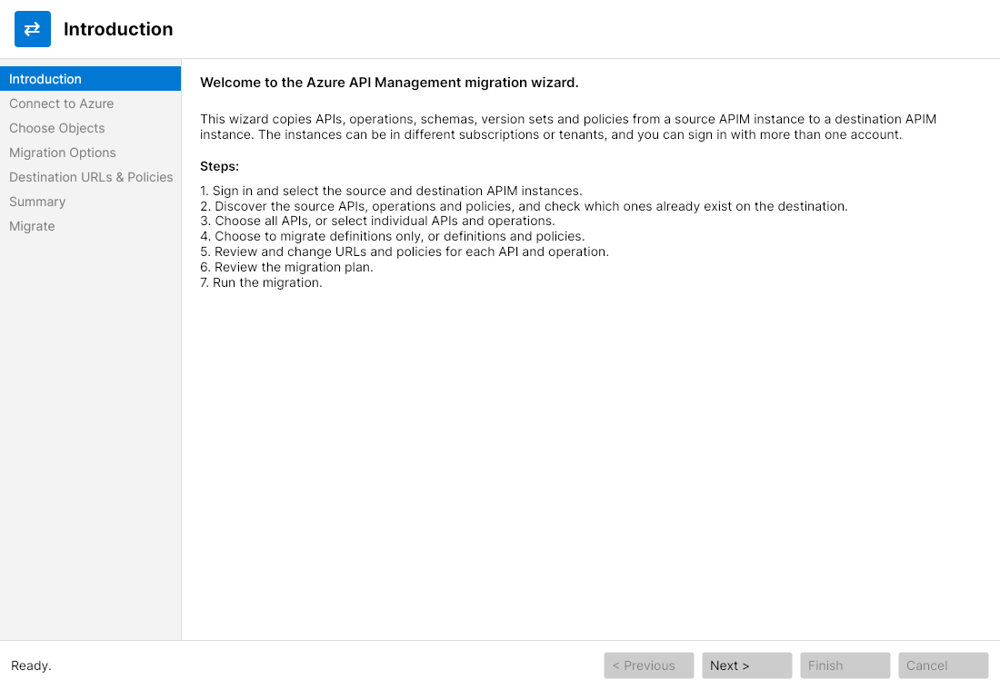
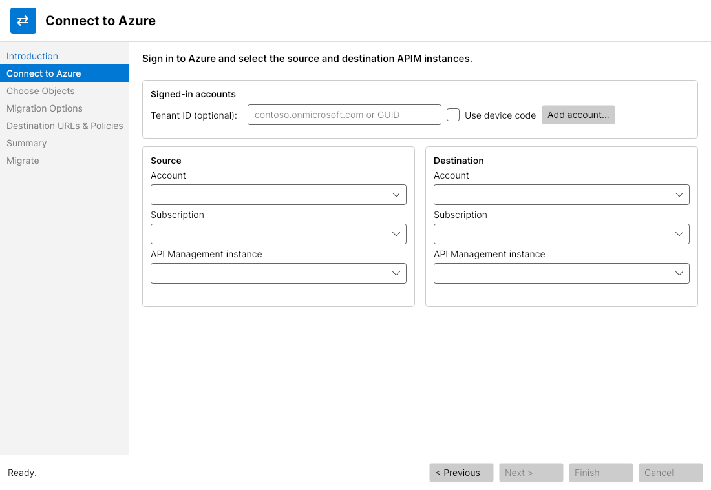

# Azure APIM migration tool

## Purpose

Azure APIM Migration Tool helps move APIs from one Azure API Management (APIM) service to another. It guides you through signing in, selecting source and destination services, choosing what to migrate, reviewing destination changes, and running the migration. The services can be in different subscriptions or tenants, and you can use more than one signed-in account.

## How it was built

This is a desktop application built with C# and .NET 8. Its user interface uses Avalonia, with the CommunityToolkit MVVM library for view-model support. Azure sign-in uses Azure.Identity, and Azure Resource Manager operations use the Azure Resource Manager API Management SDK.

The application presents migration as a step-by-step wizard. It discovers APIs and operations on the source, checks for existing destination resources, lets you configure the migration, and then applies the selected changes to the destination. It can also generate ARM, Terraform (azapi), or PowerShell deployment files from the migration plan.

## Benefits

- **Flexible migrations:** Migrate everything or select specific APIs and operations; optionally include schemas and policies.
- **More control over destination changes:** See which APIs and operations already exist, choose whether to overwrite selected operations, and decide whether to update settings for existing APIs.
- **Review and adapt before applying:** Inspect a migration summary and edit destination paths, service URLs, and policy XML, including find-and-replace across URLs and policies.
- **Handle common APIM dependencies:** When policies are included, the tool can migrate referenced named values and backends along with API and operation policies.
- **Support different deployment workflows:** Apply the migration directly or export the plan as an ARM template, Terraform configuration, or PowerShell script.

## Screenshots

  
  

<em>Introduction · Connect to Azure</em>

